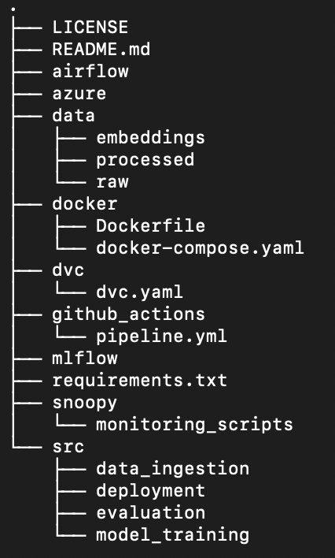

# AskRC

## Table of Contents
1. [Introduction](#1-introduction)
2. [Dataset Information](#2-dataset-information)
   - [Dataset Introduction](#21-dataset-introduction)
   - [Data Card](#22-data-card)
   - [Data Sources](#23-data-sources)
   - [Data Rights and Privacy](#24-data-rights-and-privacy)
3. [GitHub Repository](#3-github-repository)
   - [Folder Structure](#folder-structure)
4. [Project Scope](#4-project-scope)
   - [Problems](#41-problems)
   - [Current Solutions](#42-current-solutions)
   - [Proposed Solutions](#43-proposed-solutions)

## 1. Introduction
The Research Computing Department at Northeastern University offers numerous resources to researchers, yet these offerings are underutilized due to a lack of awareness. This project aims to develop a **Retrieval-Augmented Generation (RAG)** chatbot to address these issues by providing an interactive platform where users can ask questions and receive relevant, informative responses based on existing documentation.

By developing this chatbot, we will enhance awareness of the Research Computing Department's offerings and simplify the process of accessing resources, ultimately promoting more effective use of these valuable services.

**RAG-based chatbots** are ideal because they combine information retrieval with generation, ensuring responses are factually accurate and traceable to source documents. This solution is designed to promote resource discovery while maintaining the integrity and accuracy of the information being provided to users.

Our project includes developing an end-to-end **Machine Learning Operations (MLOps)** pipeline, including data ingestion, preprocessing, model training, and deployment. The chatbot will be deployed as a scalable serverless endpoint, enabling users to seamlessly interact and get the information they need.

## 2. Dataset Information

### 2.1 Dataset Introduction
The dataset will primarily come from the **Research Computing Department's website** at Northeastern University. This includes FAQs, documentation, and resource descriptions. Our chatbot will use this data to answer relevant queries accurately.

### 2.2 Data Card
- **Dataset Size:** Flexible; new documents can be added as the department updates its resources.
- **Data Format:** Textual data extracted from HTML pages and PDFs.
- **Data Types:** Text-based segments, categorized into FAQs, resource descriptions, and procedural documentation.
- **Data Processing:** Data will be segmented, encoded into embeddings, and stored for efficient retrieval by the RAG model.

### 2.3 Data Sources
- **Website:** Research Computing Department website at Northeastern University.
- **Documents:** HTML pages, PDF files, and other hosted resources.

### 2.4 Data Rights and Privacy
All public data on the Research Computing Department's website is eligible for educational use per Northeastern University's data policies. The project will ensure **FERPA compliance** and adhere to ethical web scraping practices, ensuring no personal or sensitive information is collected or processed.

## 3. GitHub Repository
The repository will contain a `README` file, which includes essential project information such as installation instructions, usage guidelines, and details of the folder structure.

### Folder Structure
The repository will follow this structure:

- **askRC (root directory):** Contains the main project components.
  - **airflow:** Configurations and DAGs for workflow automation.
  - **azure:** Infrastructure scripts and logic apps specific to Azure services.
  - **data:** Divided into `raw`, `processed`, and `embeddings` subfolders.
  - **dvc:** Data Version Control files, including `dvc.yaml`.
  - **docker:** `Dockerfile` and `docker-compose.yaml` for containerization.
  - **github_actions:** Workflow automation scripts.
  - **mlflow:** Directories for tracking model experiments.
  - **snoopy:** Monitoring scripts for the pipeline.
  - **src:** Divided into `data_ingestion`, `model_training`, `evaluation`, and `deployment` folders.
  - **README.md:** Project documentation.
  - **requirements.txt:** Lists all dependencies for the project.

## 4. Project Scope

### 4.1 Problems
- **Lack of Awareness:** Researchers are often unaware of the services offered by the Research Computing Department.
- **Access to Resources:** Navigating the information on the department's website is challenging for researchers, leading to difficulty in accessing resources.
- **Incident Overload:** Due to the challenges of finding information, many issues that could be resolved through self-service result in a large number of incident reports, increasing the workload for research assistants and employees.

### 4.2 Current Solutions
- **Manual Search:** Currently, researchers manually browse the website to find relevant information, which is inefficient and time-consuming.
- **Incident Tickets:** Every time an issue arises, a ticket is created, and the researcher must wait for the issue to be resolved by a research assistant, leading to delays in productivity.

### 4.3 Proposed Solutions
- **RAG-based Chatbot:** Develop a RAG chatbot that can efficiently answer common questions related to the department's resources and services.
- **Improved Resource Discovery:** Leverage existing information from the department's website to enhance the chatbot’s accuracy in responding to user queries, making resource discovery more efficient.

#test-3